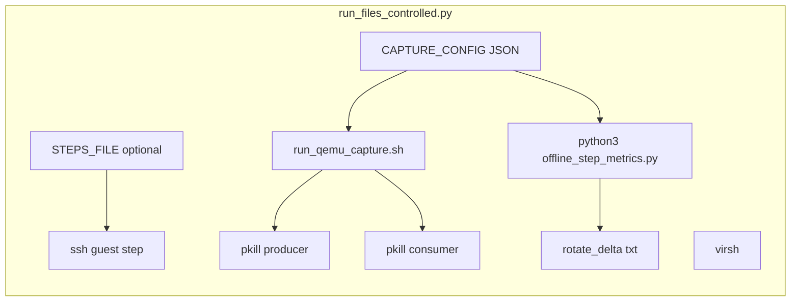
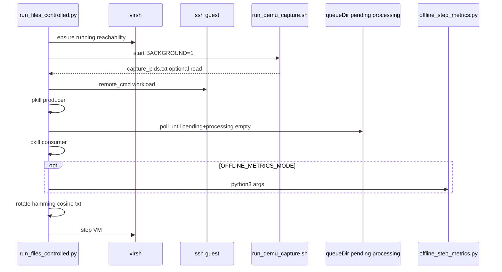

# Active pipeline file and folder map

This page is a conservative audit **traced only from** `VM_sampler/VM_Capture_QEMU/run_files_controlled.py`. Anything not clearly referenced by that script (open, `os.system`, path derived from its config) is listed under [Excluded from the active controller path](#excluded-from-the-active-controller-path) rather than marked as used.

Secondary context: after `CAPTURE_MODE=1`, the controller runs `./run_qemu_capture.sh`, which starts additional scripts. Those are noted under [Indirect: started by `run_qemu_capture.sh`](#indirect-started-by-run_qemu_capturesh) so the map stays honest about what Python invokes directly versus what the launcher starts.

---

## 1. Scripts and commands the controller invokes

All invocations use `os.system` unless noted.

| Invoked as | When | Evidence |
|------------|------|----------|
| `virsh -c … domstate …` redirect to `/tmp/vm_state.txt` | `virsh_state()` | Lines 79–90 |
| `virsh -c … resume …` / `start …` | `ensure_vm_running()` | Lines 95–104 |
| `virsh -c … shutdown …` / `destroy …` | `stop_vm()` | Lines 132–144 |
| `ssh` or `sshpass -p … ssh …` + quoted remote command | each step | `ssh_base()`, `main()` line 505 |
| `cd <CAPTURE_ROOT> && … CONFIG=… PRODUCER_SCRIPT=… BACKGROUND=1 ./run_qemu_capture.sh` | `CAPTURE_MODE` and `start_capture()` | Lines 171–174 |
| `pkill -f capture_producer_qemu_pmemsave.sh` | after guest step when capture on | Lines 190–193 |
| `pkill -f capture_consumer_qemu.sh` | after queue drain when capture on | Lines 196–199 |
| `python3 <OFFLINE_METRICS_SCRIPT> …` | `OFFLINE_METRICS_MODE` and `run_offline_step_metrics()` | Lines 310–324 |
| `pgrep -f capture_producer_qemu_pmemsave.sh` / `…consumer…` | `pause_capture_processes()` / `_capture_process_pids()` only | Lines 333–345 — **not called from `main()`** |

**Not invoked by `main()`:** `pause_capture_processes()`, `resume_capture_processes()`, `stop_capture()` (defined but unused in the active loop).

---

## 2. Files the controller reads

| Path | Purpose |
|------|---------|
| `CAPTURE_CONFIG` (default `CAPTURE_ROOT/config_qemu_upc.json`) | JSON: `queueDir`, `outputDir`; also `streaming.projectRoot` for offline root resolution |
| `STEPS_FILE` | If set: one workload command per non-empty, non-`#` line |
| `CAPTURE_ROOT/capture_pids.txt` | Optional: first two lines as PIDs after `start_capture()` (lines 178–186) |
| `/tmp/vm_state.txt` | Written by shell redirect from `virsh domstate`, then read in Python (lines 79–90) |

**Directory reads (via glob, not full tree walk):**

- `<queueDir>/pending/*.json` — count for drain wait (lines 235–242)
- `<queueDir>/processing/*.json` — same (lines 235–242)

`queueDir` comes from `CAPTURE_CONFIG` JSON (`capture_queue_dir()`).

---

## 3. Files and directories the controller writes or mutates

| Action | Path | Notes |
|--------|------|--------|
| **Not opened for write by Python** | `/tmp/vm_state.txt` | Created/overwritten by `virsh … > /tmp/vm_state.txt` via shell |
| **Creates dirs** | `outputDir` from config, and `outputDir/rotated/<test_name>/{hamming,cosine}/` | `rotate_delta_files()` lines 392–401 (`mkdir`) |
| **Moves (rename)** | `outputDir/hamming/*.txt` and `outputDir/cosine/*.txt` → `outputDir/rotated/<test_name>/hamming|cosine/` | `rotate_delta_files()` lines 404–408; collision adds timestamp suffix |

The controller **does not** write `capture_pids.txt`; that file is produced by `run_qemu_capture.sh` when `BACKGROUND=1` (see launcher script).

---

## 4. Guest workload paths (default embedded list)

The host does **not** read `VM_executables/` from disk. It only sends SSH command strings. With default `load_steps()` (no `STEPS_FILE`), those strings reference these **guest** paths:

| Guest path (in command string) |
|-------------------------------|
| `~/memorySignal/VM_executables/run_idle.sh` |
| `~/memorySignal/VM_executables/mem_stream.py` |
| `~/memorySignal/VM_executables/mem_pointer_chase.py` |
| `~/memorySignal/VM_executables/mem_alloc_touch_pages.py` |
| `~/memorySignal/VM_executables/io_seq_fsync.py` |
| `~/memorySignal/VM_executables/io_rand_rw.py` |
| `~/memorySignal/VM_executables/io_many_files.py` |

Repository-side counterparts (for documentation only): `VM_executables/*.sh` and `VM_executables/*.py` with the same basenames.

If `STEPS_FILE` is set, guest commands are **whatever** that file contains; they are not validated against `VM_executables/`.

---

## 5. Offline analysis script triggered by the controller

| Script | Env override | When |
|--------|----------------|------|
| `offline_step_metrics.py` | `OFFLINE_METRICS_SCRIPT` (default: same directory as `run_files_controlled.py`) | `OFFLINE_METRICS_MODE=1`, after queue drain, if `step_matrix` non-empty and files exist |

Additional gating inside `run_offline_step_metrics()`: script file must exist, matrix file must exist, `OFFLINE_PROJECT_ROOT` or `streaming.projectRoot` in config must resolve (lines 282–304).

**What the controller does not do:** import metric packages; it only shells out to `python3` with CLI args. Further outputs under `<output_root>/offline/...` are produced inside `offline_step_metrics.py`, not in `run_files_controlled.py`.

---

## 6. Outputs moved, rotated, or persisted (controller vs downstream)

| Behavior | Who | What |
|----------|-----|------|
| **Rotate** | `run_files_controlled.py` | Delta `*.txt` under `outputDir/{hamming,cosine}/` → `outputDir/rotated/<test_name>/{hamming,cosine}/` |
| **Step matrix path** | Controller sets `RUN_MATRIX` env; consumer appends | `queueDir/run_matrix_<test_name>.npy` when `step_run_matrix_path()` succeeds |
| **Queue drain** | Controller polls only | Does not delete queue files; consumer moves jobs |
| **Offline artifacts** | `offline_step_metrics.py` | Writes under `output_root/offline/...` and baseline dir when invoked |
| **RAW dumps, jobs, streaming** | Producer / consumer / Rust binary | Not performed inside `run_files_controlled.py`; see `QEMU_CAPTURE_PIPELINE.md` |

---

## Indirect: started by `run_qemu_capture.sh`

The Python controller runs **one** shell script: `./run_qemu_capture.sh` from `CAPTURE_ROOT` with `CONFIG`, `PRODUCER_SCRIPT`, `BACKGROUND=1`, and optionally `RUN_MATRIX`, `OFFLINE_MODE`, `BORG*`.

That launcher starts (defaults):

- `PRODUCER_SCRIPT` → default `capture_producer_qemu_pmemsave.sh`
- `CONSUMER_SCRIPT` → default `capture_consumer_qemu.sh` (not set by Python; launcher default)

So the **active chain** from the controller’s single explicit script invocation is:  
`run_qemu_capture.sh` → producer + consumer. Anything else in the repo is excluded unless pulled in by those scripts or by `CAPTURE_CONFIG`.

---

## Dependency map (controller-centric)

---

## Flow map (one step, capture on)

---

## Used files list (conservative)

**Host script entrypoint**

- `VM_sampler/VM_Capture_QEMU/run_files_controlled.py`

**Always read when capture or offline paths are used**

- `VM_sampler/VM_Capture_QEMU/config_qemu_upc.json` — default `CAPTURE_CONFIG` when `CAPTURE_ROOT` is the script directory

**Invoked by controller shell**

- `VM_sampler/VM_Capture_QEMU/run_qemu_capture.sh` — relative to `CAPTURE_ROOT`
- Default `CAPTURE_PRODUCER_SCRIPT`: `VM_sampler/VM_Capture_QEMU/capture_producer_qemu_pmemsave.sh`
- Default `OFFLINE_METRICS_SCRIPT`: `VM_sampler/VM_Capture_QEMU/offline_step_metrics.py`

**Indirect (launcher defaults; not passed by Python)**

- `VM_sampler/VM_Capture_QEMU/capture_consumer_qemu.sh`

**Guest workloads (default step list only; host repo copies)**

- `VM_executables/run_idle.sh`
- `VM_executables/mem_stream.py`
- `VM_executables/mem_pointer_chase.py`
- `VM_executables/mem_alloc_touch_pages.py`
- `VM_executables/io_seq_fsync.py`
- `VM_executables/io_rand_rw.py`
- `VM_executables/io_many_files.py`

**Optional**

- Host path given by `STEPS_FILE` (any file; not limited to `VM_executables/`)

**Runtime host files (not repo)**

- `/tmp/vm_state.txt`
- `CAPTURE_ROOT/capture_pids.txt` (created by launcher, read by controller)

---

## Excluded from the active controller path

These exist under `VM_sampler/VM_Capture_QEMU/` or nearby but are **not** opened, executed, or required by `run_files_controlled.py`:

- `capture_producer_qemu.sh`
- `capture_producer_qemu_user_raw.sh`
- `cleanup_qemu_capture.sh`
- `fix_line_endings_server.sh`
- `README.md`, `RAW_CAPTURE_ALTERNATIVE.md`, `docs/RUN_CONTROLLED_CAPTURE.md` — documentation only
- `steps_phase_blocks.txt`, `steps_cycle_repetition.txt`, `steps_transition_stress.txt` — unused unless the user sets `STEPS_FILE` to one of them

**Guest repo folder**

- `VM_executables/run_files.sh` — not in the default `load_steps()` list

**Rust binary path** — not invoked by Python; configured for the consumer (`rustDeltaCalculationProgram` in JSON).

**Documentation-only tree**

- `docs/controlled-qemu-pipeline/*` — not part of runtime execution

---

## Evidence vs inference

| Topic | Direct evidence | Inference |
|-------|-----------------|------------|
| Which shell scripts Python runs | `start_capture`, `run_offline_step_metrics`, `pkill` patterns | — |
| Consumer script name | — | Default `CONSUMER_SCRIPT` in `run_qemu_capture.sh`; Python never sets it |
| Guest has files under `~/memorySignal/VM_executables/` | — | Assumed by default SSH strings; not checked on host |
| Producer/consumer side effects (dumps, matrix, streaming) | — | Documented in producer/consumer/config, not in `run_files_controlled.py` |
