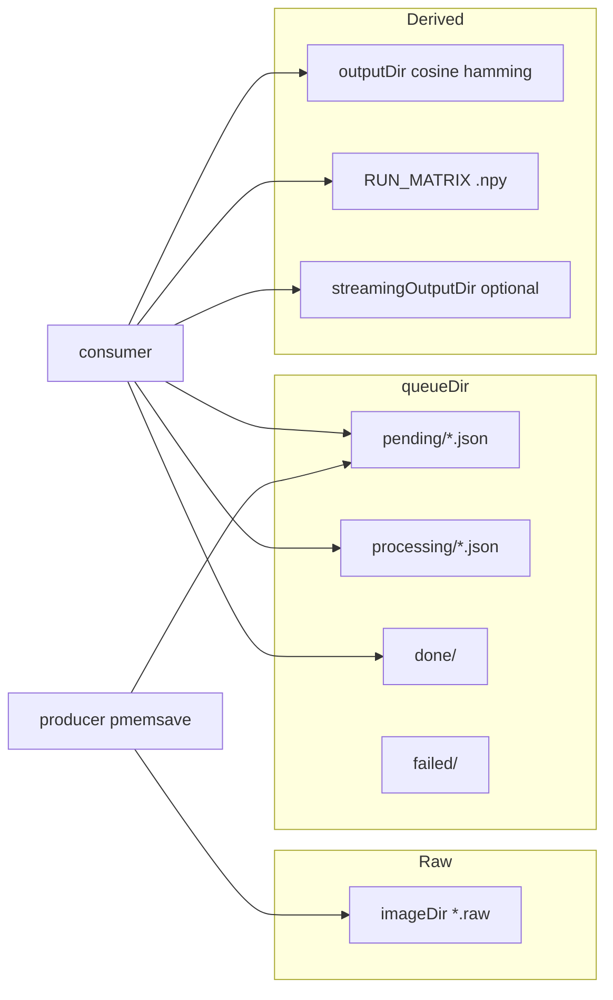

# Active QEMU capture subsystem (`VM_Capture_QEMU`)

This document describes the **capture subsystem** used when `run_files_controlled.py` runs with **`CAPTURE_MODE=1`**. Scope is limited to the **`VM_sampler/VM_Capture_QEMU/`** scripts and config that participate in that path:

| Artifact | Role |
|----------|------|
| `run_qemu_capture.sh` | Launcher: starts producer and consumer together |
| `capture_producer_qemu_pmemsave.sh` | Producer: RAW dumps + queue jobs (`PRODUCER_SCRIPT` default) |
| `capture_consumer_qemu.sh` | Consumer: delta computation + run matrix (`CONSUMER_SCRIPT` default from launcher) |
| `config_qemu_upc.json` | Active config file (`CAPTURE_CONFIG` default from the host controller) |

The host controller (`run_files_controlled.py`) does **not** import these scripts; it **`cd`s to `CAPTURE_ROOT`** and runs **`./run_qemu_capture.sh`** with environment variables. Other files in `VM_Capture_QEMU/` (alternate producers, cleanup helpers, narrative docs) are **out of scope** here unless the active invocation chain references them — it does not.

---

## How this subsystem fits the controlled experiment

Capture is **one phase inside each workload step**, bracketed by the host controller:

1. VM up, SSH ready.
2. **Start capture** — launcher brings up producer + consumer (background).
3. Optional capture warmup sleep.
4. **Guest workload** runs over SSH (the experiment stimulus for that step).
5. **Stop producer** — no new dumps for this step.
6. **Drain queue** — wait until `pending` + `processing` job counts are zero.
7. **Stop consumer**.
8. Optional **offline metrics** and **rotation** of delta text files (handled by the controller and `offline_step_metrics.py`, not by the capture scripts themselves).

So the capture subsystem runs **concurrently with** the guest step: the producer keeps sampling memory while the workload executes, and the consumer keeps turning snapshot pairs into deltas and matrix columns until the controller stops the producer and waits for drain.

---

## Configuration: single JSON contract

All three scripts read the same **`CONFIG`** path (exported by the launcher; default in active flow is **`config_qemu_upc.json`**).

Typical fields the active pipeline uses:

| Field | Use |
|-------|-----|
| `domain` | Libvirt domain for `virsh` / QEMU monitor (producer) |
| `ramSizeMb` | Size passed to `pmemsave` (producer) |
| `imageDir` | Directory for RAW dump files (producer writes) |
| `outputDir` | Passed to Rust delta as output root; cosine/hamming text trees (consumer writes) |
| `queueDir` | Base for `pending/`, `processing/`, `done/`, `failed/` (producer + consumer) |
| `rustDeltaCalculationProgram` | Executable path for `prev curr outputDir` (consumer) |
| `intervalMsec` | Time between capture iterations (producer) |
| `backpressure.*` | Limits pending+processing jobs before producer sleeps |
| `vmStatePolling.*` | Producer waits for paused/running |
| `chownUser` / `chownGroup` | Optional `sudo chown` on new dumps so the consumer can read them |
| `streaming.*` | Live streaming metrics (consumer); suppressed when host sets `OFFLINE_MODE=1` |

Paths in the committed `config_qemu_upc.json` are **machine-specific** (example: `/project/homes/...`); the structural roles (`imageDir`, `queueDir`, `outputDir`) are what matter for understanding behavior.

---

## `run_qemu_capture.sh` — launcher

**What it does**

- Verifies `PRODUCER_SCRIPT`, `CONSUMER_SCRIPT`, and `CONFIG` exist.
- **`export CONFIG`** so child scripts see it.
- If **`BACKGROUND=1`** (the active controlled path): starts **`nohup bash "$PRODUCER_SCRIPT"`** and **`nohup bash "$CONSUMER_SCRIPT"`**, appends logs to **`producer.log`** and **`consumer.log`** under **`ROOT`**, writes PIDs to **`capture_pids.txt`**.

**Defaults used when the host controller does not override them**

- `PRODUCER_SCRIPT` → `capture_producer_qemu_pmemsave.sh`
- `CONSUMER_SCRIPT` → `capture_consumer_qemu.sh`

The host controller sets **`PRODUCER_SCRIPT`** explicitly; it does **not** set **`CONSUMER_SCRIPT`**, so the **default consumer** above is the one that runs.

**Interaction**

- It does not implement capture logic; it only spawns the two long-running processes and optional SSH utility modes. The **`run_files_controlled.py`** path uses **`BACKGROUND=1`** and does **not** use `SSH_ONLY` / `SSH_BEFORE_START` (those are unused for the controlled experiment entrypoint).

---

## `capture_producer_qemu_pmemsave.sh` — producer

**Responsibilities**

- Enforce **backpressure**: if `pending + processing` job count ≥ `maxPendingJobs`, sleep and do not take a new dump.
- **Suspend** the VM (`virsh … suspend`), wait until **paused**.
- Issue **`qemu-monitor-command` `pmemsave`** to write a **flat RAW** file of size `ramSizeMb` into **`imageDir`** (e.g. `memory_dump-<timestamp>.raw`).
- Optionally **`sudo chown`** the new file for user readability.
- When both **previous** and **current** dump paths exist, atomically write a JSON job **`{ prev, curr, output }`** into **`queueDir/pending/`** (`output` is **`outputDir`** from config).
- **Resume** the VM, wait until **running**, sleep **`intervalMsec`**, repeat.

**Raw capture artifacts**

- **RAW memory images**: files under **`imageDir`** as produced by `pmemsave`.

**Queue / intermediate files**

- **Job JSON** files in **`queueDir/pending/`** (producer creates via `jq` + `mv`).

The producer **does not** run the Rust delta; it only feeds the queue.

---

## `capture_consumer_qemu.sh` — consumer

**Responsibilities**

- Ensure queue subdirs exist: **`pending`**, **`processing`**, **`done`**, **`failed`**.
- Loop: pick oldest **`*.json`** in **`pending`**, move to **`processing`**, run **`process_job`**.
- For each job: read **`prev`**, **`curr`**, **`output`**; run **`rustDeltaCalculationProgram prev curr output`** (Rust writes per-page delta text under **`output/cosine/`** and/or **`output/hamming/`** depending on implementation).
- Pick the **latest** frame file under the configured metric subdirectory (`cosine` vs `hamming` per `deltaMetric`), **append** that vector as a new **column** to **`RUN_MATRIX`** (numpy `.npy` on disk, shape `[pages, frames]`), with file locking.
- Optionally trigger **live streaming** Python module when enough frames exist — **skipped** if **`OFFLINE_MODE=1`** (set by the host when `OFFLINE_METRICS_MODE=1`).
- **Delete `prev`** after processing (or async Borg handoff if enabled); **`curr`** is retained for the next pair in the rolling chain unless **raw retention** moves it (see below).
- Move job JSON to **`done`** or **`failed`**.

**Derived outputs**

| Location | Content |
|----------|---------|
| **`outputDir`** / `cosine/`, `hamming/` | Delta **`.txt`** frames (one value per page per frame), produced by Rust |
| **`queueDir`** / `run_matrix.npy` or env **`RUN_MATRIX`** | Accumulated matrix `.npy` |
| **`streaming.streamingOutputDir`** (if live streaming runs) | Streaming metric outputs |
| **`RUN_MATRIX.streaming.pid`** | PID file for in-flight streaming subprocess |

**Queue behavior**

- **State machine**: `pending` → `processing` → `done` or `failed`.
- The host controller’s **drain wait** matches this: it polls until **`pending`** and **`processing`** contain no **`*.json`**.

**`rawRetention` (referenced in script, inactive in default config)**

- The consumer contains branches for optional RAW dump retention and raw-matrix metrics when **`rawRetention.enabled`** is true (or env override). In **`config_qemu_upc.json`**, **`rawRetention.enabled`** is **`false`**, so that path is **not** part of the active default behavior; it is documented only because the **same consumer script** implements it.

---

## Producer vs consumer (summary)

| | Producer | Consumer |
|---|----------|----------|
| **Inputs** | Config, libvirt domain, QEMU monitor via `virsh` | Config, queue JSON jobs, Rust binary path |
| **Produces** | RAW files in `imageDir`, jobs in `pending/` | Delta text under `outputDir`, columns in `RUN_MATRIX`, moves jobs to `done`/`failed` |
| **Deletes / retains dumps** | Does not delete dumps after enqueue | Deletes `prev` after job (or Borg); chain logic for `curr` |
| **Pacing** | Backpressure on queue depth | Processes as fast as possible; may lag producer |

---

## Artifact map (active defaults)

---

## Environment variables the host adds (beyond `CONFIG`)

From **`run_files_controlled.py`** → **`start_capture()`**:

- **`RUN_MATRIX`** — per-step matrix path (`queueDir/run_matrix_<test_name>.npy`), isolates steps.
- **`OFFLINE_MODE=1`** when **`OFFLINE_METRICS_MODE=1`** — consumer skips live streaming trigger.
- Optional **`BORG`**, **`BORG_REPO`**, **`BORG_PASSPHRASE`** — consumer may archive dumps (async).

---

## Explicit vs inferred

| Topic | Explicit in active scripts | Inferred |
|-------|----------------------------|----------|
| Producer is pmemsave script | Set by host as `PRODUCER_SCRIPT` | — |
| Consumer script name | Host does not pass it | Launcher default `capture_consumer_qemu.sh` |
| Rust binary behavior | Invoked as `prev curr outputDir` | Internal delta format |
| Exact paths on disk | Read from `config_qemu_upc.json` in repo | Deployment-specific |

---

## See also

- [`RUN_FILES_CONTROLLED_FLOW.md`](RUN_FILES_CONTROLLED_FLOW.md) — when capture starts/stops relative to guest steps
- [`ACTIVE_PIPELINE_FILE_MAP.md`](ACTIVE_PIPELINE_FILE_MAP.md) — what the controller reads and moves on the host
- [`OFFLINE_METRICS_AND_OUTPUTS.md`](OFFLINE_METRICS_AND_OUTPUTS.md) — post-step offline metrics and rotation
