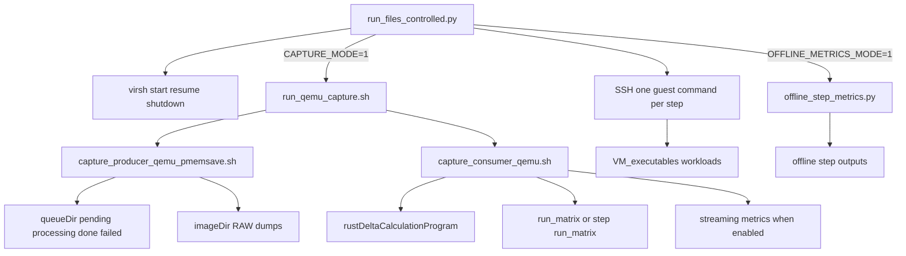

# Active Controlled QEMU Documentation

This documentation set covers only the currently active controlled QEMU capture pipeline centered on `VM_sampler/VM_Capture_QEMU/run_files_controlled.py`. The active flow is: the host-side controller powers and reaches the VM, runs one guest workload step over SSH, optionally starts the QEMU producer-consumer capture pipeline around that step, waits for queue drain, optionally triggers per-step offline metrics, rotates step outputs, and shuts the VM down before the next step. This documentation does not expand into older or alternate branches unless the active files directly reference them.

## Document Map
- [`ACTIVE_PIPELINE_FILE_MAP.md`](ACTIVE_PIPELINE_FILE_MAP.md): **conservative** file-and-folder map traced from `run_files_controlled.py` (dependency map, flow map, used vs excluded files)
- [`ACTIVE_PIPELINE_OVERVIEW.md`](ACTIVE_PIPELINE_OVERVIEW.md): high-level architecture boundary, active components, and end-to-end flow
- [`RUN_FILES_CONTROLLED_FLOW.md`](RUN_FILES_CONTROLLED_FLOW.md): host-side orchestration in `run_files_controlled.py`
- [`QEMU_CAPTURE_PIPELINE.md`](QEMU_CAPTURE_PIPELINE.md): launcher, pmemsave producer, consumer, queue, and run-matrix path
- [`GUEST_WORKLOADS.md`](GUEST_WORKLOADS.md): guest-side workloads actually executed by the active controller
- [`OFFLINE_METRICS_AND_OUTPUTS.md`](OFFLINE_METRICS_AND_OUTPUTS.md): offline stage, **import graph for `offline_step_metrics.py`**, outputs, active vs import-only `coherence_temp_spec_stability` files
- [`QUICKSTART_FOR_AI_CONTEXT.md`](QUICKSTART_FOR_AI_CONTEXT.md): compact re-grounding guide for future Cursor sessions

## Dependency map (summary)

The authoritative dependency diagram for what **Python actually invokes** is in [`ACTIVE_PIPELINE_FILE_MAP.md`](ACTIVE_PIPELINE_FILE_MAP.md). At a glance:

- `run_files_controlled.py` → reads `CAPTURE_CONFIG`, optional `STEPS_FILE`, optional `capture_pids.txt`, `/tmp/vm_state.txt`; runs `virsh`, `ssh`, `./run_qemu_capture.sh`, `pkill`, and conditionally `python3 offline_step_metrics.py`.
- `./run_qemu_capture.sh` (not imported by Python) starts the default producer and consumer scripts named in the launcher.

## Flow map (summary)

One capture-enabled step: ensure VM + SSH → start launcher → run guest command → stop producer → wait for `queueDir` `pending`/`processing` to empty → stop consumer → optional offline script → rotate `outputDir` delta `*.txt` → stop VM. Full sequence diagram: [`ACTIVE_PIPELINE_FILE_MAP.md`](ACTIVE_PIPELINE_FILE_MAP.md#flow-map-one-step-capture-on).

## Used files list (summary)

**Strictly from `run_files_controlled.py`:** the entrypoint script, default `config_qemu_upc.json`, `run_qemu_capture.sh`, default `capture_producer_qemu_pmemsave.sh`, default `offline_step_metrics.py`, and the seven default guest workload basenames under `VM_executables/` (guest path `~/memorySignal/VM_executables/...`). **Indirect:** `capture_consumer_qemu.sh` via launcher default.

Full list: [`ACTIVE_PIPELINE_FILE_MAP.md`](ACTIVE_PIPELINE_FILE_MAP.md#used-files-list-conservative).

## Excluded files list (summary)

Not part of the active controller path unless `STEPS_FILE` or env overrides say otherwise: alternate producers, cleanup/fix helpers, narrative-only docs, optional `steps_*.txt` files, `VM_executables/run_files.sh`, Rust binary (consumer-only).

Full list: [`ACTIVE_PIPELINE_FILE_MAP.md`](ACTIVE_PIPELINE_FILE_MAP.md#excluded-from-the-active-controller-path).

## Concise Architecture Map

## Active Scope
Included:
- `VM_sampler/VM_Capture_QEMU/run_files_controlled.py`
- `VM_sampler/VM_Capture_QEMU/run_qemu_capture.sh`
- `VM_sampler/VM_Capture_QEMU/capture_producer_qemu_pmemsave.sh`
- `VM_sampler/VM_Capture_QEMU/capture_consumer_qemu.sh`
- `VM_sampler/VM_Capture_QEMU/config_qemu_upc.json`
- `VM_sampler/VM_Capture_QEMU/offline_step_metrics.py`
- the workload scripts in `VM_executables/` that are directly referenced by the default step list

Excluded unless explicitly described as optional or inactive:
- alternate producers such as `capture_producer_qemu.sh` and `capture_producer_qemu_user_raw.sh`
- helper and cleanup scripts not invoked by the active controller
- broader repository branches that are not part of the active dependency chain
